## Streamplace Plays: Pokémon Emerald? EX?

Twitch Plays-style system for Streamplace. Chat collectively controls a GBA emulator via a vote engine. The backend streams JPEG frames + PCM audio + JSON state over WebSocket to a React OBS browser source, which OBS pushes to Streamplace via WHIP.

### prerequisites

- Rust (stable)
- Node.js + pnpm
- GBA BIOS (`gba_bios.bin`)
- A GBA ROM (`emerald.gba` or similar)
- For map extraction: Python 3 + the `pokeemerald` decompilation

### setup

```bash
just setup          # installs pnpm deps, clones pokeemerald, sets up python venv
just build-ui       # builds the React browser source into ./static/
just extract-maps   # (optional) extracts map PNGs from pokeemerald source
```

### configuration

Copy `config.toml` and edit to suit. All fields are required except `input.start_throttle_secs` and `emulator.auto_restore` (defaults to `false`).

### running

```bash
cargo run --release
```

The game WebSocket listens on `ws_host:ws_port`. Point the OBS browser source at:

```
http://<ws_host>:<ws_port>/
```

### overlay keyboard control

Add `?token=<admin_token>` to the browser source URL to enable direct keyboard and gamepad control. On disconnect all held keys are released automatically.

If `allow_anonymous_keyboard = true` is in config, any WS client can send inputs without a token.

### admin API

All endpoints require `Authorization: Bearer <admin_token>`.

```
GET  :9002/admin/status        → current game state + fps
POST :9002/admin/mode          {"mode": "anarchy"|"democracy"}
POST :9002/admin/save          trigger a manual save state
POST :9002/admin/pause         toggle pause
```

### development

```bash
just precommit      # cargo check + test --bins + clippy
cargo test --lib    # unit tests (no ROM required)
just e2e            # end-to-end tests (requires ROM + BIOS in tests/fixtures/)
```

### architecture

```mermaid
flowchart LR
    Chat["Streamplace chat"] -->|WS| ChatClient["chat client"]
    ChatClient --> VoteEngine["VoteEngine"]
    VoteEngine -->|pop_next_input each frame| EmulatorThread["emulator thread"]
    EmulatorThread --> EncodeThread["JPEG encode thread"]
    EncodeThread -->|broadcast::Sender cap=2| WSHandler["WS handler"]
    WSHandler -->|frames + audio + state| Browser["OBS browser source"]
    Browser -->|WHIP| Streamplace["Streamplace"]
    Browser -->|button down/up 0x06/0x07| WSHandler
```



**WebSocket message framing** (binary, 1-byte prefix):

| prefix | content |
|--------|---------|
| `0x01` | JPEG frame (240×160) |
| `0x02` | PCM audio (s16le stereo 32768 Hz) |
| `0x03` | JSON `GameState` (~4 Hz) |
| `0x04` | JSON party data (~1 Hz) |
| `0x05` | JSON player location (~2 Hz) |
| `0x06` | ← button down (overlay → server) |
| `0x07` | ← button up (overlay → server) |
